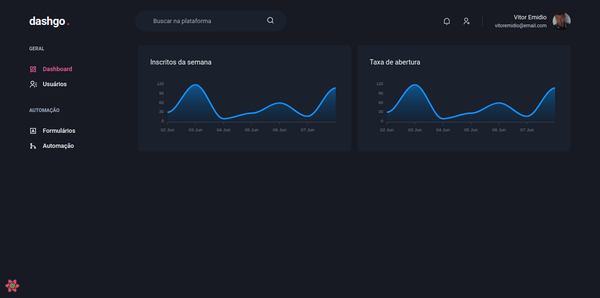
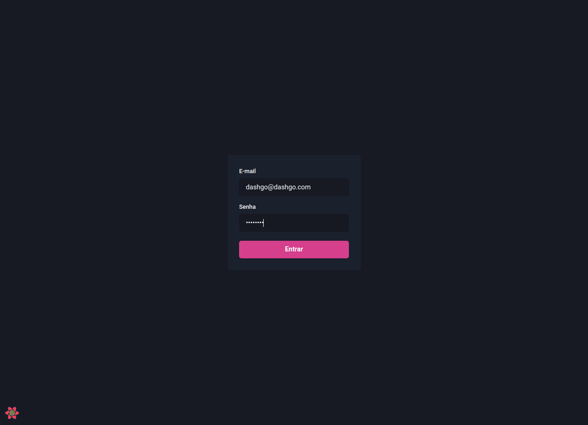
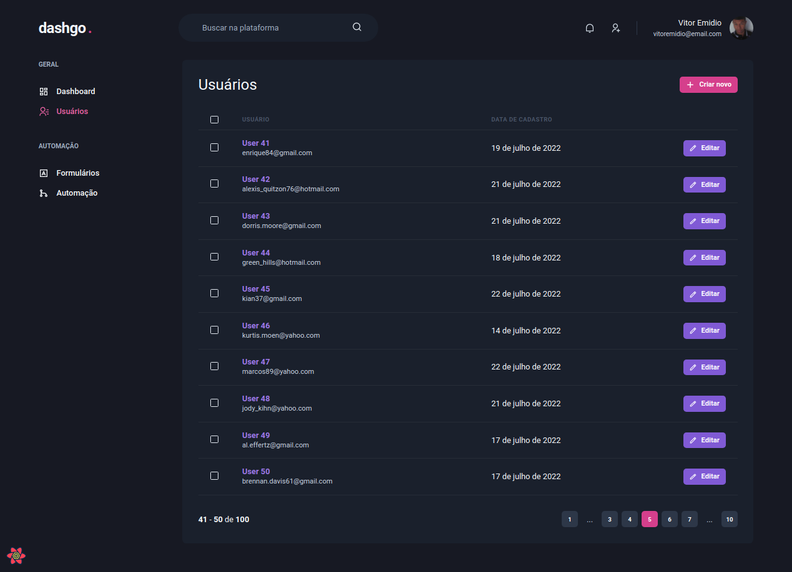
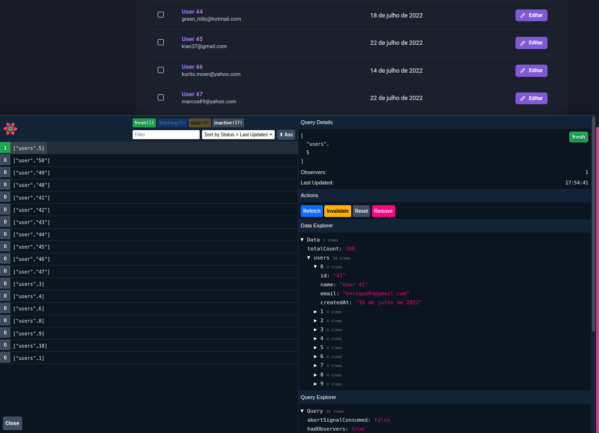

<h2 align="center">
   dashgo. - Next.js | 
</h2>

<p align="center">


</p>

---

O **Dashgo.** é uma aplicação desenvolvida utilizando Chakra UI

<p align="center">
  <a href="#-projeto">Projeto</a>&nbsp;&nbsp;&nbsp;|&nbsp;&nbsp;&nbsp;
  <a href="#-como-rodar-o-projeto">Como rodar o projeto</a>&nbsp;&nbsp;&nbsp;|&nbsp;&nbsp;&nbsp;
  <a href="#-tecnologias">Tecnologias</a>&nbsp;&nbsp;&nbsp;|&nbsp;&nbsp;&nbsp;
  <a href="#-licença">Licença</a>
</p>

## 💻 Projeto

A aplicação permite adição e listagem de usuários.

Também é possível analisar informações de estatísticas no dashboard em gráficos

**Login**


**Usuários**


**React Query**


## 🧭 Como rodar o projeto

**Clone este repositório**

```bash
git clone https://github.com/vitorsemidio-dev/ignite-reactjs-dashgo.git
```

**Acesse a pasta**

```bash
cd ignite-reactjs-dashgo.git
```

**Instale as dependências**

```bash
yarn
```

**Execute a aplicação**

```bash
yarn dev
```

## 🚀 Tecnologias

Esse projeto foi desenvolvido com as seguintes tecnologias:

- Axios
- Chakra UI
- MirageJs
- React Apexcharts
- React Hook Forms
- Next.js
- TypeScript
- Yup

## 📝 Licença

Esse projeto está sob a licença MIT. Veja o arquivo [LICENSE](LICENSE) para mais detalhes.
